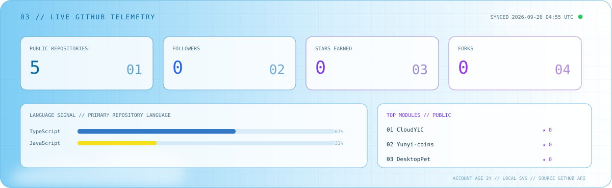

  

  <strong>从寄存器、协议与内存，一路构建到工具、服务与用户界面。</strong>
   
  From bare metal to usable products — understand deeply, build precisely.
    
  <code>C</code>&nbsp; <code>C++</code>&nbsp; <code>Python</code>&nbsp; <code>Embedded</code>&nbsp; <code>Linux</code>&nbsp; <code>CMake</code>&nbsp; <code>Docker</code>&nbsp; <code>React · learning</code>&nbsp; <code>AI · exploring</code>

 

  

 

  

 

  

 

  
  

 

  <a href="https://github.com/CloudYiC">[ EXPLORE REPOSITORIES ]</a>
    
  

